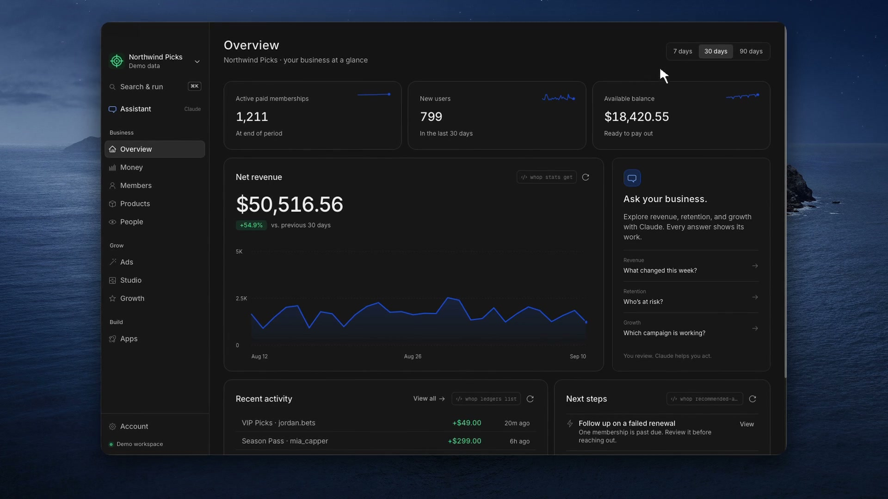
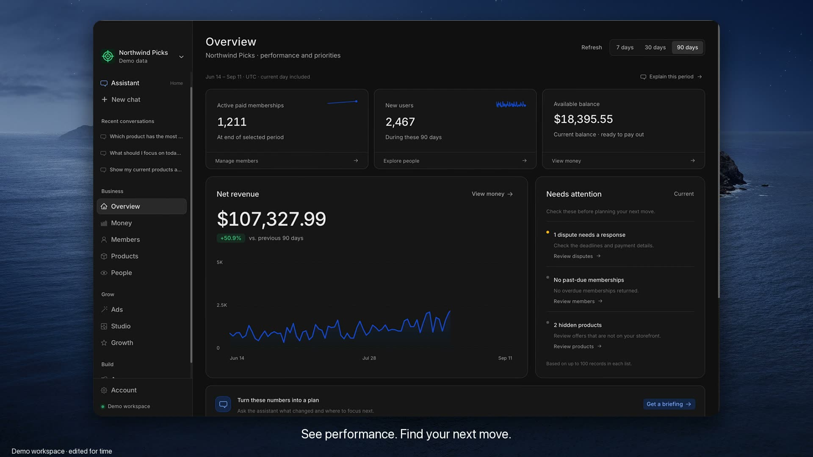
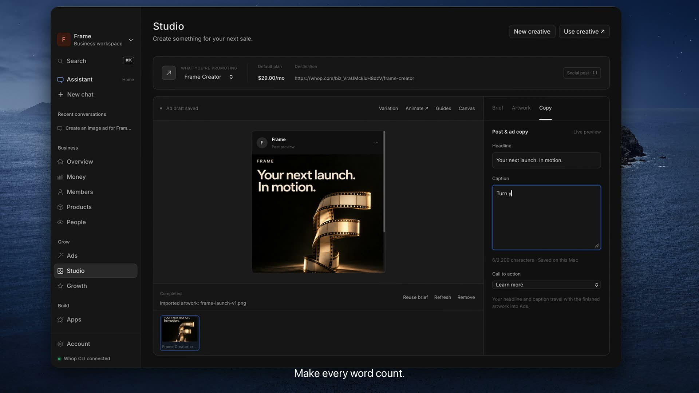

# Whop Desktop

A native Mac app for running a Whop business, built on the
[Whop CLI](https://whop.sh). Revenue, balance, members, products, ads, apps
and a Claude assistant in one window. Every panel shows the `whop` command
that produced it, and ⌘K runs any command you type.

Site, demo and install guide: [srikar-desktop.whop.site](https://srikar-desktop.whop.site/). Source for the site is in [website/](./website/).

<p align="center">
  
  
  
  
</p>

> **Unofficial, personal-use project.** Not affiliated with, endorsed by, or
> distributed by Whop. It drives the public Whop CLI and, optionally, loads
> whop.com in a separate window. "Whop" and the Whop logo are trademarks of
> their owner. Started as a fork of
> [siyabendoezdemir/whop-desktop](https://github.com/siyabendoezdemir/whop-desktop) (MIT).

---

## Demos

Four short recordings, all on the Northwind Picks demo business, cut for time. Click a frame to play.

| | |
|---|---|
| [](website/public/demo.mp4) | [](docs/media/tour.mp4) |
| **Product demo**, 17s. Ask a question, watch the command run, read the answer. Also on the [site](https://srikar-desktop.whop.site/). | **Tour**, 48s. Assistant, Overview, Studio and Ads in one sitting. |
| [](docs/media/creative-workflow.mp4) | [](docs/media/curfew.mp4) |
| **Creative workflow**, 27s. Ask for an ad in chat, finish it in Studio, save it as an ad draft. | **Curfew**, 23s. A card-testing attack showing up in the fraud dashboard. |

## What it does

Every screen is a `whop …` command with a face.

| View | Commands behind it |
|---|---|
| **Overview** | `stats get net_revenue --interval day` (30d + prior 30d delta), `memberships list --status active`, `members list`, `ledgers report --report_type balance_summary`, `ledgers list`; with wv, a **Next** panel from `wv report`: what blocks a sale or a launch, each with its fix runnable through the gate |
| **Money** | balance summary with a stacked bar (available / pending / reserve / dispute hold), `ledgers report --report_type income_statement`, ledger activity, `payouts list`, `disputes list`; with wv, a **Payouts** panel from `wv money`: one balance per currency with whether a saved method can deliver it and a Convert button through the gated swap, Whop's live payout limits with the block behind a zero, and the saved methods |
| **Members** | `memberships list` with status filters and row actions (pause, resume, cancel, all confirmed first), `members list` |
| **Products** | `products list` with default plan price, member count, visibility; publish / unpublish / delete, open store page, list plans; with wv, a "from country" select prices every plan tax-included from `wv store --from CC` |
| **People** | `people list`: location, device, events, purchases, LTV, last seen |
| **Ads** | Meta campaigns from `ad-campaigns list` with 30-day spend, impressions, clicks, results and cost per result; ad groups, ads, audiences, connected social accounts; pause / unpause / duplicate / delete, retry payment; "Plan a campaign with Claude" |
| **Studio** | Reference-based image/video generation, editable typography and cropping, named creative history, and a local ad-draft handoff; live generation is billed from your Whop balance |
| **Apps** | `apps list`, open the hosted domain, builds and logs, deploy preview, and **blueprints**: clone any whop.com/blueprints app with `apps init --template app_…` |
| **Curfew** | Native fraud dashboard: payment activity, six detection signals, risk details, incident queue, launch mode, protection settings, and interactive demo scenarios |
| **Growth** | bounties (`bounties list`: pool, paid out, submissions; cancel), referred businesses and the partner leaderboard (`partners *`) |
| **Assistant** | a Claude chat that operates the business through the CLI: every command it runs shows as a card with its output; a write comes back as a plan you approve on the card (through [wv](https://github.com/srikarsunchu/whop-view)), or stays blocked until you allow it when wv is not installed. **Raw CLI** mode is one toggle away: history (↑), ⌘L clear, JSON highlighting, copy and re-run |
| **Account** | `auth status`, `auth list` (switch profiles), `accounts get`, `team-members list`, CLI binary and version; with wv, a **Setup** panel from `wv setup`: the first hour as numbered steps, who does each, and the fix runnable through the gate |

### The assistant

"Who is past due and how much is at risk?" runs `whop memberships list --status past_due`, reads the result, and answers in two sentences with a next step. Under the hood the app launches the **Claude Code CLI** you already have (`claude -p … --output-format stream-json`) with exactly one tool allowed, `Bash(whop:*)`, and streams its events into the chat. Requirements: Claude Code installed and signed in (`claude` once in a terminal).

The `whop` that Claude sees is not the real binary. It is Whop Desktop itself running as a shim that:

- **gates every write** through [wv](https://github.com/srikarsunchu/whop-view) when it is installed, in the chat and in every action dialog (withdraw, price, publish, cancel), on the demo business too: the write comes back as a plan with before → after and a signed rerun, the chat shows it as a card with Approve and Decline, money asks for the amount typed back, a decline costs no turn, and the outcome reaches Claude as a quiet line; without wv it **blocks every write** (create, update, delete, cancel, payouts, deploy, …) unless the "Allow writes" switch is on, returning a `WRITE_BLOCKED` result Claude relays to you;
- **serves the demo business** from fixtures the app writes, so the demo works end to end without touching a real account;
- passes reads straight through to the real CLI.

Conversations are kept per business and resume with `--resume`, so follow-ups have context. Each reply shows model, turns, time and cost. Claude's system prompt carries a compact reference for every CLI area the app covers (money, members, products, ads, AI media, bounties, partners, apps and blueprints), so it goes straight to the right command. Buttons across the app ("Plan a campaign with Claude", "Draft a bounty with Claude", "Ask Claude which blueprint") open the chat with a ready prompt.

Plus:

- **⌘1 to ⌘9** jump between views.
- **⌘K palette.** Jump to a view, switch business, run one of the common
  commands, or type any `whop …` line and hit ↵.
- **Command strip** on every panel: copy it, run it in the Terminal, refresh,
  and see when it last ran.
- **Business switcher** fed by `whop auth status` and `whop accounts list`,
  plus a labeled demo business (Northwind Picks) so every panel can be seen
  populated.
- **whop.com window** (⌘⇧O) for the parts of Whop that have no CLI (chat,
  storefront editing), with persistent login, download handling and the
  Google passkey workaround.
- **Menu-bar icon**, **⌘⇧W** global show/hide, close-hides-the-window.
- **Sparklines** on the KPI tiles (net revenue, paid active members, new users, balance) from `whop stats get … --interval day`.

### Curfew fraud dashboard

**Curfew** under Business is a fraud dashboard drawn with the same Frosted components as everything else. Nothing is embedded from the web. The demo business ships three scenarios (normal traffic, a card-testing attack, a product launch) that run in memory and never touch a live service. See [docs/curfew-native.md](docs/curfew-native.md) and the [23-second demo](docs/media/curfew.mp4).

To watch a real business, paste a Whop account API key for that business into the setup dialog. The dialog spells out the permissions and the automatic refund and access-removal behavior before you submit. The app checks the key against Whop, confirms it belongs to the selected business, then hands it to the Curfew backend over stdin. The key is never written to disk by the app and never appears in a command line. Each business gets its own session cookie file under the app data directory, mode 0600 in a 0700 directory.

The Rust bridge talks to one fixed endpoint, `https://curfew-blush.vercel.app`. It polls every 15 seconds, keeps showing the last good data if a poll fails, and asks before changing launch mode, settings, pending actions or disconnecting. Curfew keeps monitoring on its own server while the app is closed. Logging in to the Whop CLI does not connect Curfew.

## Design

The UI is Whop's own: [Frosted UI](https://github.com/whopio/frosted-ui)
components inside `<Theme appearance="dark">`, Inter for text and Geist Mono
for commands, and only Frosted tokens for color, spacing, radius and motion.
Side by side with whop.com's dark chrome it reads as the same product: the
same greys (`#111` ground, `#191919` panels, `#eee` text), the same 12 / 14 px
Inter, the same radii.

## Requirements

- macOS 11+ (developed on macOS 26, Apple Silicon)
- **Whop CLI**, installed and signed in:

```bash
curl -fsSL https://whop.com/install.sh | sh
whop login
whop quickstart   # pick the business the CLI should use
```

The app looks for `whop` in `$WHOP_BIN`, `PATH`, `~/.local/bin`,
`/opt/homebrew/bin` and `/usr/local/bin`.

- **wv** (optional, recommended): the gated face of the CLI. Writes in the assistant become plans you approve. Needs Node 22.6+.

```bash
git clone https://github.com/srikarsunchu/whop-view && cd whop-view && pnpm install && pnpm build && pnpm link --global
```

The app looks for `wv` in `$WV_BIN`, `PATH`, `~/.local/bin`, `~/Library/pnpm`, `/opt/homebrew/bin` and `/usr/local/bin`.

## Download and first launch

[Download the Mac preview](https://github.com/srikarsunchu/whop-desktop/releases/download/v0.4.2-preview.1/Whop-Desktop-0.4.2-Apple-Silicon.dmg) (0.4.2, Apple Silicon, macOS 11+). Signed with Developer ID, notarized, stapled. Drag it into Applications.

First launch asks two things. **Set up my workspace** finds your existing Whop and Claude logins, or walks you through them, then picks a business. **Try a demo first** opens Northwind Picks, a made-up business, and still offers to connect Claude so the chat works. Skip Claude and you land in Overview; connect it and you land in Assistant. The setup is always available again under **Account → Workspace setup**. Details in [docs/onboarding.md](docs/onboarding.md).

Studio's demo previews are labeled samples. Live image generation costs money from your Whop balance and asks first.

## Build

Node 18+, pnpm 9+, Rust stable, Xcode Command Line Tools.

```bash
pnpm install
pnpm tauri dev                  # debug build, Web Inspector under View
pnpm tauri build --bundles app  # -> src-tauri/target/release/bundle/macos/Whop Desktop.app
```

Launch hints for screenshots and testing:

```bash
WHOP_DESKTOP_ACCOUNT=biz_demoNorthwind WHOP_DESKTOP_VIEW=overview \
  "/Applications/Whop Desktop.app/Contents/MacOS/Whop Desktop"
```

## How it works, and what it never does

- The main window is a local React app. Its only native capability is a
  handful of Tauri commands in `src-tauri/src/lib.rs` that run the `whop`
  binary (never a shell) with `--format json` and return the output.
- **Whop CLI authentication stays in the CLI.** Switching profiles is
  `whop auth switch`. Curfew is connected separately, with its own key and
  its own per-business session file.
- Every write (cancel a membership, publish a product, switch profile) shows
  the exact command and asks first. The CLI has no sandbox or dry-run.
- The optional whop.com window loads the site as a top-level external URL and
  is never granted Tauri IPC (`capabilities/main-capability.json` has no
  `remote` allowlist). The only thing injected there is `src-tauri/js/init.js`,
  an app-authored script for CSS tweaks and the Google passkey fix.
- Debug logs record command names only, never arguments or output.
- The assistant's Claude process gets Bash allowlisted to `whop …` and, with wv installed, `wv …`; none of your own MCP servers, skills, or settings (`--strict-mcp-config --setting-sources project`); and `whop` resolves to the gated shim above. With wv installed, its seven `whop-*` skills are copied into the app's config folder under `.claude/skills` on every run, so the Skill tool can invoke them and Read is allowed on that folder and nowhere else.

## Known limitations

- **Scopes.** Two resources need more than a plain browser sign-in, and the
  app performs the fix itself instead of failing silently:
  - `notifications *` needs `user:notifications:read`. The current CLI's
    OAuth flow already requests it, so a "Missing required permission" error
    only means the login predates that scope. The callout offers "Sign in
    with Whop" and the fresh token has it.
  - `webhooks *` needs `developer:manage_webhook`, which Whop grants only to
    API keys. The callout (and Account → Connect API key) opens a dialog that
    runs `whop auth login --method api-key`; the key reaches the CLI through
    `WHOP_API_KEY`, never the command line, and is stored only by the CLI.
    The new profile becomes active; switch back from Account → Saved
    profiles.
  Recommended actions are not enabled on every business yet.
- **Ledger and stats shapes** are read defensively; if Whop changes the JSON,
  the Terminal still shows the raw output.
- **Google sign-in in the web window.** WKWebView only supports cross-device
  passkeys, so the injected script removes WebAuthn on `accounts.google.com`
  to force the password flow. If Google still offers a passkey, click "Try
  another way".
- The published preview supports Apple Silicon only; Intel is not included.

## Files

| Path | Purpose |
|---|---|
| `src/` | React app: `App.tsx`, `lib/whop.ts` (CLI bridge + cache), `lib/demo.ts` (demo business), `views/`, `components/` |
| `src-tauri/src/lib.rs` | Tauri commands, windows, tray, hotkey, menu |
| `src-tauri/js/init.js` | Script injected into the whop.com window only |
| `src-tauri/capabilities/main-capability.json` | Local-frontend capability, no remote access |
| `scripts/` | Icon generation and the signed-build script |

## Clearing app data

```bash
rm -rf ~/Library/WebKit/com.srikarsunchu.whopdesktop
rm -rf ~/Library/Application\ Support/com.srikarsunchu.whopdesktop
rm -rf ~/Library/Caches/com.srikarsunchu.whopdesktop
```

## License & trademarks

MIT, see [LICENSE](./LICENSE). Original wrapper © siyabendoezdemir, this
project © srikarsunchu. "Whop" and the Whop logo are trademarks of their
respective owner; this license covers this project's own source code only.
