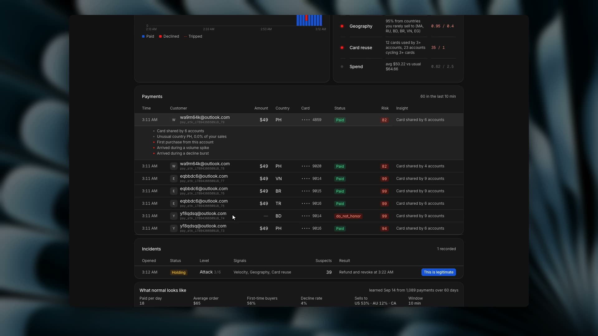

# Native Curfew dashboard

Curfew used to load as a hosted page in a webview, with a loop that kept repositioning the pane and a Tauri feature that was flaky. All of that is gone. The dashboard is now React and Frosted UI like the rest of the app.

*23 seconds. A card-testing attack lands in the demo business and the dashboard reacts.*

## What's on the screen

Connection status, four summary cards, a payment activity chart you can hover, all six detection signals with their explanations, incident history with the option to cancel a pending action, payment rows filtered by risk with a reason for each score, launch mode, protection settings, a baseline refresh, and disconnect. Anything destructive or anything that changes protection settings shows a review dialog first. The demo scenarios are synthetic and run in memory.

## The bridge

The Rust side talks to exactly two hosts: the Curfew API and Whop's account-verification endpoint. Before connecting it checks the key belongs to the selected business. Before any action it checks the stored session still matches that business. Action names and payload sizes are whitelisted. The API key goes to Curfew over stdin, never as an argument, and the app never writes it to disk or localStorage. Session cookies are stored per business in a private app-data directory.

## What I tested

Production frontend and macOS builds. Rust tests for bad accounts, bad action names, payload limits and curl escaping. The existing business workflow suite.

In the native app: the disconnected state, the connection form, switching into and out of the demo, attack signals and pending counts, cancelling an incident, confirming a launch-mode change and seeing status update, and reviewing and saving protection settings.

I did not submit a real key, change real protection settings or issue a refund. The authenticated paths still need a run against a connected account.

## What did not change

The Curfew backend still handles webhooks, learning, holds and refunds on its own. This change does not deploy or modify it. A signed-in state read goes through its existing `/api/state`, hold timer included. Sessions from the old embedded browser do not carry over. Reconnect from the native form.
